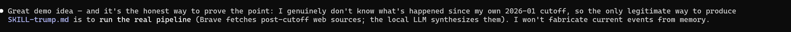

# Skill3 — a fully local AI Skill Relearner

[](https://opensource.org/licenses/Apache-2.0)
[](https://github.com/PIsberg/skill3/actions/workflows/ci.yml)
[](https://adoptium.net/)
[](#development)

Skill3 is a lightweight Java CLI that **relearns a technical skill** for an AI
agent. It discovers documentation sources, scores them for **authority** and
**freshness** (anchored to a target model's knowledge cutoff), synthesizes them
with a **local LLM** into an Agent Skills `SKILL.md`, and vets the result with
NVIDIA's [SkillSpector](https://github.com/NVIDIA/SkillSpector).

The point: a model only knows what existed before its training cutoff. Skill3
gathers what changed **after** that cutoff and bakes it into a skill the agent
can load — so it stops emitting deprecated patterns.

- **General** — no skill is hardcoded; the model plans the searches and freshness is
  driven by a cutoff *date*, so it works for any topic (technical or not).
- **Delta, not primer** — a generated skill covers only what changed *after* the
  cutoff and tells the model to rely on existing knowledge for the rest.
- **Local-first** — by default synthesis runs on a local LLM (Ollama), so the only
  external service is discovery (Brave Search). A hosted provider (any
  OpenAI-compatible gateway, or Claude via the native SDK) is opt-in.
- **Cutoff-anchored** — the discovery window is bounded by the target model's cutoff
  (below) and today (above), so results are the slice the model doesn't already know.
- **Quality-gated** — the build runs Error Prone, PMD, SpotBugs and ArchUnit, and
  ships compile-time AI guardrails via [VibeTags](https://github.com/PIsberg/vibetags).

See [docs/SPEC.md](docs/SPEC.md) for the full specification,
[docs/ARCHITECTURE.md](docs/ARCHITECTURE.md) for the design, and
[docs/PLAN.md](docs/PLAN.md) for the roadmap.

---

## What is a knowledge cutoff — and why it's the whole idea

A large language model is trained on a snapshot of the world that ends on a fixed date:
its **knowledge cutoff**. Everything before that date the model may know; everything
**after** it the model has simply never seen. Claude Opus 4.8, for example, has a cutoff
of **January 2026** — ask it about anything from February 2026 onward and it will either
say it doesn't know, or (worse) confidently answer using stale, pre-cutoff information.

The cutoff is not a bug to be patched; it's a hard property of how the model was trained.
You can't retrain the model, but you *can* hand it the missing slice of the world at
runtime. That is the entire premise of Skill3:

> **Take a topic and a model's cutoff date, gather only what changed *after* that date,
> and compile it into a `SKILL.md` the agent loads — so it answers from current reality
> instead of stale memory.**

Concretely, the cutoff date drives a date-bounded web search: discovery starts at the
cutoff and ends today (`2026-01-01to<today>`), so the pipeline spends its effort on
material the model could not possibly already know, rather than re-summarising what it
learned in training. Everything else — authority scoring, freshness ranking, local
synthesis, vetting — exists to turn that fresh slice into something an agent can trust.

This works for **any** topic, not just code (see the [examples](#example-output) — a
software protocol *and* current events). The cutoff is the dial; the skill is the output.

---

## Why it matters: MCP versioning

The cleanest illustration of the problem Skill3 solves is the **Model Context Protocol**.
MCP revisions are **date-versioned** (`2024-11-05` → `2025-03-26` → `2025-06-18`), and the
changes between them are not backward-compatible: a new HTTP transport, a required
`MCP-Protocol-Version` header, removed JSON-RPC batching, new primitives like elicitation.

A model trained before mid-2025 confidently emits the *old* protocol — wrong transport,
missing header, assumptions that silently break real integrations. That's exactly the
post-cutoff drift Skill3 targets: anchor discovery at the model's cutoff, pull what changed
since, and bake it into a skill the agent loads.

See the generated example: **[`examples/SKILL-mcp.md`](examples/SKILL-mcp.md)** — an MCP skill
centred on protocol versioning and revision negotiation.

---

## The pipeline: plan → Brave → synthesize → (verify) → vet

Skill3 is a linear pipeline (`LearnPipeline`). The synthesis model (local Ollama by
default, or a hosted provider) is used at four points — to **plan** the searches, to
**synthesize** the skill, optionally to **verify** it, and to **revise** it during
vetting. **Brave** does discovery and **SkillSpector** does safety vetting.

```
                 ┌──────── Phase 0: Plan (model) ─────────┐
  topic + cutoff ►  QueryPlanner → N post-cutoff queries  │   topic-agnostic; no per-topic logic
                 └──────────────────┬─────────────────────┘
                                    ▼
                 ┌──────────── Phase 1: Discovery & Retrieval ─────────────┐
  per query ─► Brave Search ─► fetch pages (parallel) ─► extract dates ─► score authority
                 └───────────────────────────────────────────┬───────────┘
                                                              ▼
                 ┌──────────────── Phase 2: Ranking ──────────────┐
                 │  consensus (prune lonely code blocks)           │   ranked ContextBundle
                 │  freshness: cutoff ≤ published ≤ today           │   (future-dated dropped)
                 │  authoritative hosts ranked first               │
                 └──────────────────────────────┬─────────────────┘
                                                 ▼
                 ┌──────── Phase 3: Synthesis (model) ────────┐
                 │  model drafts a post-cutoff DELTA           │   ← post-processor, not the model,
                 │  deterministic post-processor guarantees    │     guarantees the frontmatter
                 │  spec-compliant frontmatter + footer        │
                 └──────────────────────┬─────────────────────┘
                                        ▼
                 ┌──── Phase 3b: Verify (model, --verify) ────┐
                 │  re-ground each claim against the sources;  │   optional accuracy gate
                 │  demote future-dated releases to "planned"  │
                 └──────────────────────┬─────────────────────┘
                                        ▼
                 ┌──────── Phase 4: Vetting (SkillSpector) ────┐
                 │  static scan → findings                     │
                 │  self-correction loop revises (bounded)     │
                 └──────────────────────┬─────────────────────┘
                                        ▼
                        skills/<topic>/SKILL.md  (+ index.html preview)
```

| Stage | Component | Where | Notes |
|---|---|---|---|
| **Plan** | `QueryPlanner` (the synthesis model) | model | Topic-agnostic: the model expands the topic into up to 6 post-cutoff facet queries (it already knows the topic, so it knows what might have changed). No hardcoded per-topic logic. |
| **Discover** | Brave Search API → web scraper fallback, **or** `--input-file` (`FileCorpus`) | Network / **offline** | Runs every planned query (freshness-windowed); needs an API key. Or skip the network entirely and supply a user-curated corpus file — see [Offline discovery](#offline-discovery-with---input-file). |
| **Fetch** | `RetrievalService` over virtual threads | Network | Merges/de-dupes URLs across queries, then fetches **concurrently** (one virtual thread per URL); results merged on the caller thread. |
| **Date / authority** | `DateExtractor`, `AuthorityScorer` | Local | Published-date extraction + per-host trust; `--authoritative` hosts rank first. |
| **Rank** | `IngestionPipeline` (`ConsensusValidator`, `FreshnessFilter`) | Local | Code kept only with cross-source agreement; freshness anchored to the cutoff **and bounded above by today** (future-dated sources dropped). |
| **Synthesize** | synthesis model + `SkillMdPostProcessor` | model + local | Model drafts a post-cutoff delta; the post-processor — not the model — guarantees valid frontmatter and stamps the footer. |
| **Verify** *(opt-in)* | `Verifier` (`--verify`) | model | Re-grounds every claim against the sources; removes unsupported claims, demotes future-dated releases. Worthwhile only with a capable model. |
| **Vet** | `SkillSpectorRunner` + `SelfCorrectionLoop` | Local | Static safety scan; re-drafts on findings (bounded iterations). "Clean" means safe, not necessarily accurate — hence Verify. |

With the default **local** provider, only **Discover** leaves the machine — planning,
synthesis, verification, and vetting are all local. Choosing `--llm-provider openai`
or `anthropic` moves the model calls to a hosted endpoint.

---

## Requirements

- **JDK 25** (compiled with `--release 25`). Gradle provisions the JDK 25 toolchain
  automatically (auto-detected or downloaded via the Foojay resolver), so you don't
  need JDK 25 on `JAVA_HOME` — any JDK that runs Gradle will do.
- A **local LLM** exposed over an OpenAI-compatible API (e.g. [Ollama](https://ollama.com)).
- **Python 3.12–3.14** (only for `setup`; SkillSpector's supported range).
- A **[Brave Search API](https://brave.com/search/api/) key** for discovery.

## Build

```bash
./gradlew build        # compile + full quality gate (analysis) + tests
./gradlew test         # tests only (JUnit + ArchUnit)
./gradlew run --args="..."   # run the CLI
```

`build` runs the complete quality gate — see [Development](#development).

---

## Setup

### 1. Install SkillSpector (one-time)

```bash
./gradlew run --args="setup"
```

This provisions a local Python venv and installs SkillSpector into it. `learn`
runs SkillSpector with `--no-llm` so vetting stays fully local (static analysis only).

### 2. Get a Brave Search key

Discovery uses the [Brave Search API](https://brave.com/search/api/) — the **only
external service `learn` needs**.

1. Create an account at <https://brave.com/search/api/>.
2. Subscribe to a plan. The **Free** tier (a few thousand queries/month) is enough
   to try Skill3; a card may be required for verification even on the free plan.
3. Create a subscription token (your API key).
4. Provide it one of two ways:

```bash
# Option A — environment variable (picked up automatically)
export BRAVE_SEARCH_API_KEY="your-token"

# Option B — per run
./gradlew run --args="learn mcp --llm-model qwen2.5-coder:7b --brave-key your-token"
```

The token is sent in the `X-Subscription-Token` header. If no key is found,
`learn` stops early with a clear message; the key is treated as a secret
(`@AIPrivacy` — never logged).

> You don't strictly need a key to evaluate the pipeline: the example in
> [`examples/`](examples/) was produced from seeded source URLs, and the tests
> stub discovery behind the `SearchClient` interface. For a real run with **no
> key and no network at all**, supply your own sources with `--input-file` (see
> [Offline discovery](#offline-discovery-with---input-file)).

---

## Usage

### Learn a skill

```bash
./gradlew run --args="learn mcp \
  --target-model claude-opus-4-8 \
  --llm-model qwen2.5-coder:7b \
  --brave-key $BRAVE_SEARCH_API_KEY"
```

Common options for `learn`:

| Option | Meaning | Default |
|---|---|---|
| `--target-model <id>` | Model the skill is *for*; used only to look up a knowledge cutoff. | `claude-opus-4-8` |
| `--cutoff-time <yyyy-MM>` | Explicit cutoff override (wins over `--target-model`). | — |
| `--strict-cutoff` | Hard-exclude sources at/before the cutoff. | off |
| `--llm-model <name>` | Synthesis model name. | **required** |
| `--llm-provider <p>` | `local` \| `openai` \| `anthropic`. | `local` |
| `--llm-endpoint <url>` | OpenAI-compatible endpoint (local/openai). | `http://localhost:11434` |
| `--llm-key <key>` | Key for hosted providers (`openai`: `LLM_API_KEY`; `anthropic`: `ANTHROPIC_API_KEY`). | env |
| `--max-tokens <n>` | Max output tokens for synthesis. | `8192` |
| `--temperature <t>` | Sampling temperature (local/openai only). | server default |
| `--rich-context` | Feed more sources/excerpts to the model (suits big-context models). | off |
| `--authoritative <hosts>` | Comma-separated hosts ranked first (e.g. `modelcontextprotocol.io,github.com`). | — |
| `--verify` / `--no-verify` | Re-ground every claim against the sources (accuracy gate, one extra model call). | on for `openai`/`anthropic`, off for `local` |
| `--brave-key <key>` | Brave Search key (or `BRAVE_SEARCH_API_KEY`). | env |
| `--input-file <path>` | Offline discovery: a user-curated corpus file used instead of Brave (no key/network). See [Offline discovery](#offline-discovery-with---input-file). | — |
| `--dry-run` | Stop after discovery + ranking; print the sources, dates and scores; write nothing. | off |
| `--no-cache` | Bypass the on-disk cache of search results and fetched pages (`~/.skill3/cache`, 7-day TTL). | off |
| `--output-dir <path>` | Where the skill is written. | `./skills/<skill-name>` |

Output: `./skills/<skill-name>/SKILL.md` (+ an `index.html` preview and a `run.json`
provenance manifest recording the queries, the exact sources and scores that backed the
skill, the verify/vet outcome, and per-phase timings).

Discovery and model calls retry transient failures (connection errors, `429`, `5xx`) with
exponential backoff (honoring `Retry-After`), and search results + fetched pages are cached
under `~/.skill3/cache` (7-day TTL) so re-running a topic skips the network — pass `--no-cache`
to force fresh fetches.

### Offline discovery with `--input-file`

`--input-file` replaces Brave with a **user-curated corpus file** you fill in
yourself — the same role Brave plays (supplying source documents), but offline:
no key, no network, fully reproducible. It slots in behind the same
`SearchClient`/`PageFetcher` seams (`FileCorpus`), so everything downstream —
date extraction, authority scoring, consensus, freshness, synthesis and vetting —
runs exactly as it would for live pages.

```bash
./gradlew run --args="learn mcp \
  --llm-model qwen2.5-coder:7b \
  --input-file ./my-sources.txt"
```

**File format.** Documents are separated by a line that reads exactly
`=== SOURCE ===`. Each starts with `key: value` headers (`url` required;
`title` and `date` as `yyyy-MM-dd` optional), then a blank line, then the body.
The body may be plain text, Markdown (fenced ```` ``` ```` code blocks and `#`
headings are recognised), or raw HTML:

````
=== SOURCE ===
url: https://modelcontextprotocol.io/specification
title: MCP Specification (2026-03 revision)
date: 2026-03-01

# Resources
The _meta field is now accepted on every request in the 2026-03 revision.

```
client.call("tools/list");
```

=== SOURCE ===
url: https://github.com/org/repo/releases
date: 2026-04-01

Release notes describing the new behaviour and flags...
````

The whole file is treated as the curated result set (every document is used —
the model's planned queries don't filter it down). Anything before the first
`=== SOURCE ===` marker is ignored, so you can keep a comment at the top. A
ready-to-copy template lives at
[`examples/input-corpus-sample.txt`](examples/input-corpus-sample.txt).

### Choosing a synthesis model

Synthesis is the quality bottleneck (see the examples below — the *same* sources, very
different skills). Three providers, in order of fidelity to the local-first design:

1. **Bigger local model (default, keeps the no-key design).** Just pull a stronger Ollama
   model — no code, no key:
   ```bash
   ./gradlew run --args="learn mcp --llm-model qwen2.5-coder:32b --brave-key $BRAVE_SEARCH_API_KEY"
   ```
2. **Any OpenAI-compatible gateway** (OpenRouter, Together, Groq, …) — opt-in, breaks the
   no-key property only when you use it:
   ```bash
   ./gradlew run --args="learn mcp --llm-provider openai \
     --llm-endpoint https://openrouter.ai/api --llm-model <model> \
     --llm-key $LLM_API_KEY --rich-context --brave-key $BRAVE_SEARCH_API_KEY"
   ```
3. **Claude (native Anthropic SDK)** — highest quality. Uses the official
   `anthropic-java` SDK and the Messages API (not an OpenAI shim):
   ```bash
   export ANTHROPIC_API_KEY=sk-ant-...
   ./gradlew run --args="learn mcp --llm-provider anthropic \
     --llm-model claude-opus-4-8 --rich-context --brave-key $BRAVE_SEARCH_API_KEY"
   ```
   `--temperature` is ignored for `anthropic` (Opus 4.8 rejects sampling parameters).

### How the cutoff drives the search window

The resolved cutoff (from `--target-model`, or `--cutoff-time` if given) becomes
the **start** of the Brave discovery window; today is the end. For
`claude-opus-4-8` (cutoff `2026-01`) a run today searches:

```
Cutoff: claude-opus-4-8 (2026-01)
Search window: 2026-01-01to2026-06-22
```

So discovery skips what the model already knows and surfaces only what's new since
its cutoff. Widen it for a given run with `--cutoff-time` (e.g. `--cutoff-time 2024-01`).

> **Output quality scales with the synthesis model.** A small model (e.g.
> `qwen2.5:3b`) hallucinates and conflates unrelated tools; a capable coder model
> (e.g. `qwen2.5-coder:7b` or larger) produces accurate content from the same sources.

---

## Development

`./gradlew build` enforces a quality gate. Configuration lives in
[`config/`](config/) and [`build.gradle`](build.gradle).

| Tool | Scope | Config |
|---|---|---|
| **Error Prone** (`2.50.0`) | main sources, woven into `javac` | `build.gradle` |
| **PMD** (`7.24.0`) | main sources | [`config/pmd-ruleset.xml`](config/pmd-ruleset.xml) |
| **SpotBugs** (`6.5.8`, effort `Max`) | main classes | [`config/spotbugs-exclude.xml`](config/spotbugs-exclude.xml) |
| **ArchUnit** (`1.4.0`) | layering / cycles | [`ArchitectureTest`](src/test/java/se/deversity/skill3/ArchitectureTest.java) |
| **JSpecify** (`1.0.0`) | nullness | `@NullMarked` `package-info.java` per package |
| **async-test-lib** (`1.7.0-RC1`) | concurrency stress tests (`@AsyncTest`) | [`ConcurrencySafetyTest`](src/test/java/se/deversity/skill3/ConcurrencySafetyTest.java) |

Tests run on JUnit Jupiter 6; the hosted Claude provider uses the official
`anthropic-java` SDK.

ArchUnit keeps the layering honest: `model` is a dependency-free leaf, only the
`Skill3App` composition root touches `cli`, and the sub-packages stay acyclic.

### AI guardrails (VibeTags)

The codebase is annotated with [VibeTags](https://github.com/PIsberg/vibetags) —
compile-time, `SOURCE`-retention annotations (zero runtime cost) that mark intent
for AI tools, e.g.:

- `@AIPrivacy` on the Brave API key (never log/echo it),
- `@AICore` on `SkillMdPostProcessor` (guarantees spec compliance — change with care),
- `@AISecure` on `NameSanitizer` / `BraveSearchClient`,
- `@AIImmutable` on `ContextBundle`, `@AIContext` on `CutoffResolver`.

On every compile the processor regenerates the guardrail files (`CLAUDE.md`,
`llms.txt`, `llms-full.txt`) from these annotations. There's also a
[`vibetags-usage`](.claude/skills/vibetags-usage/SKILL.md) skill describing the
full annotation set.

---

## Example output

A skill3 output is a **delta**, not a primer: it covers only what changed *after* the target
model's cutoff and explicitly tells the model to rely on existing knowledge for the rest.

**MCP — `claude-opus-4-8`** ([`examples/SKILL-mcp-claude.md`](examples/SKILL-mcp-claude.md)):
the `QueryPlanner`'s protocol-focused queries (spec release, roadmap, security) surface the
actual changelog, so the skill is a true protocol delta — the **2026-07-28 stateless release
candidate** (SEP-2567/2575 remove the session header and `initialize` handshake; new
`Mcp-Method`/`Mcp-Name` headers; `ttlMs`/`cacheScope` caching), the SEP-2577 deprecation of
Roots/Sampling/Logging, the 2026 roadmap, and 2026 CVEs — with the pre-cutoff fundamentals
treated as already known. ([`examples/SKILL-mcp.md`](examples/SKILL-mcp.md) is the older
local-model run, hand-edited for accuracy — kept for the model-quality contrast.)

**Current events — `claude-opus-4-8`** ([`examples/SKILL-trump-claude.md`](examples/SKILL-trump-claude.md)):
proves the same machinery works for a non-technical topic. The `QueryPlanner` expanded
`trump` into six facet queries (latest news, executive orders, tariffs, foreign policy, legal
rulings, midterms), so the skill spans the full post-cutoff picture — the Iran war, the
Venezuela strike, the Supreme Court striking down IEEPA tariffs and the Section 122/301/232
pivot, ICE detention litigation, midterms — not just one story, all from sources dated after
the cutoff. "When to use" points the model back to its existing knowledge for the baseline.
The [local-model version](examples/SKILL-trump.md) is kept alongside it.



- **Caveat:** these are *raw, unverified* model summaries of post-cutoff pages — included to
  demonstrate the pipeline, not as fact-checked references. Judge claims against the sources.

- [`examples/SKILL-json-rpc.md`](examples/SKILL-json-rpc.md) — an earlier locally-synthesized
  skill, vetted clean by SkillSpector.

Every generated skill ends with a provenance footer —
`_Created with [skill3](https://github.com/PIsberg/skill3)._` — stamped deterministically
by the generator (idempotently, even across self-correction revisions).

The generated `SKILL.md` follows the
[Agent Skills](https://platform.claude.com/docs/en/agents-and-tools/agent-skills/overview)
standard. Skill3 deterministically guarantees format compliance (name charset,
reserved-word stripping, description limits) regardless of what the LLM emits.

## License

Apache-2.0 — see [LICENSE](LICENSE).
