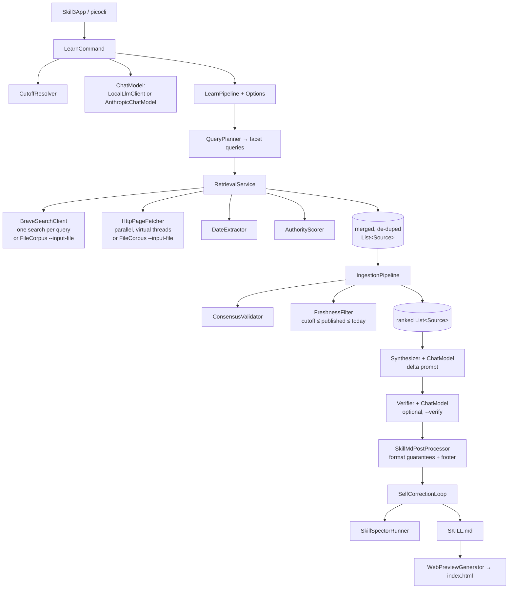

# Skill3 Architecture

This document describes how Skill3 is structured and how data flows through it.
For *what* it does, see [SPEC.md](SPEC.md); for the build order, see [PLAN.md](PLAN.md).

## Overview

Skill3 is a single-process Java CLI. A `learn` invocation runs a linear pipeline;
each stage enriches or filters a list of `Source` objects until a `SKILL.md` is
synthesized, optionally verified, and vetted.

The guiding invariant: a generated skill is a **post-cutoff delta**, not a primer.
The target model already knows the topic up to its knowledge cutoff; the pipeline
gathers only what changed *after* that cutoff and compiles it into a skill. Discovery
is **topic-agnostic** — the model itself plans the searches, so nothing is hardcoded
per topic.

Every model-driven stage (`QueryPlanner`, `Synthesizer`, `Verifier`, and the
self-correction reviser) talks to the **same** injected `ChatModel`, so the choice of
provider (local Ollama, an OpenAI-compatible gateway, or Claude) applies uniformly.

## Packages

| Package | Responsibility |
|---|---|
| `se.deversity.skill3` | `Skill3App` entry point and `LearnPipeline` orchestration (with `LearnPipeline.Options`). |
| `se.deversity.skill3.cli` | `SetupCommand`, `LearnCommand` (picocli), `Venv`. |
| `se.deversity.skill3.model` | `Source` (mutable carrier), `ContextBundle` (immutable record), `Cutoff` — plain data. |
| `se.deversity.skill3.pipeline` | Discovery + ingestion: `QueryPlanner`, `RetrievalService`, `BraveSearchClient`, `FileCorpus` (offline `--input-file`, implements both `SearchClient` and `PageFetcher`), `HttpPageFetcher`/`PageFetcher`, `DateExtractor`, `AuthorityScorer`, `ConsensusValidator`, `FreshnessFilter`, `IngestionPipeline`, `CutoffResolver`, `SearchClient`. |
| `se.deversity.skill3.llm` | Synthesis: `ChatModel` (SAM); `LocalLlmClient` (OpenAI-compatible — local or hosted gateway via Bearer key); `AnthropicChatModel` (native `anthropic-java` SDK); `Synthesizer`, `Verifier`, `SkillMdPostProcessor`, `NameSanitizer`. |
| `se.deversity.skill3.skillspector` | `SkillSpectorRunner` (ProcessBuilder), `SkillSpectorReport`, `Finding`, `Reviser`, `SelfCorrectionLoop`, `SkillSpectorUnavailableException`. |
| `se.deversity.skill3.web` | `WebPreviewGenerator`. |

Every package carries a `@NullMarked` `package-info.java` (JSpecify). Layering is
enforced by an ArchUnit test: `model` depends on nothing internal, only the
`Skill3App` root touches `cli`, and the sub-packages stay acyclic.

## Key design decisions

### Skills are post-cutoff deltas, not primers
The `Synthesizer` system prompt instructs the model to include **only** what changed
after the cutoff and to treat fundamentals as already-known. The cutoff (and today's
date) are passed in the user prompt. This is the core premise — re-explaining what the
model already knows wastes the mechanism.

### Topic-agnostic discovery (the model plans the searches)
`QueryPlanner` asks the `ChatModel` to expand a topic into up to six distinct
post-cutoff *facet* queries. There is no per-topic logic: the same planner serves a
protocol, a person, or a release. It falls back to the bare topic if planning fails.
`RetrievalService` runs every query through `BraveSearchClient`, merges and
de-duplicates the result URLs, and fetches the pages **concurrently** on a
virtual-thread-per-task executor (blocking I/O, independent work); results are merged
on the caller thread, so no `Source` is shared between workers.

### Offline discovery (`--input-file` / `FileCorpus`)
`FileCorpus` is a no-network alternative to Brave: the user pastes the relevant
documents into one curated file and passes `--input-file`. It implements **both**
discovery seams — `SearchClient` (returns every URL in the file) and `PageFetcher`
(replays each document's body as synthesized HTML) — so `LearnCommand` injects one
instance into both slots and the rest of the pipeline is identical to a live run.
Bodies may be plain text, Markdown, or HTML; the file is the curated result set, so
the whole corpus is used regardless of the model's planned queries. No Brave key or
network egress is needed for discovery in this mode.

### Cutoff-anchored freshness, bounded both ends
`CutoffResolver` maps `--target-model` to a knowledge-cutoff month (overridable with
`--cutoff-time`); that date is also the lower bound of the Brave freshness window.
`FreshnessFilter` scores each source `authority × recency` (post-cutoff publication
earns full recency) and sorts best-first, so a post-cutoff authoritative source
(`1.0 × 1.0`) outranks pre-cutoff content (`≤ 1.0 × 0.5`). `--strict-cutoff` promotes
the soft floor to a hard filter. An **upper bound** (`today`) drops sources dated after
the run — Brave's freshness window is only a hint, and a future-dated page is a leak or
mis-dated, never valid evidence.

### Authoritative ranking (config-driven)
`AuthorityScorer` scores by host: configured authoritative hosts → `1.0`, known
low-authority/blog hosts → `0.2`, standard repos → `0.7`, default `0.5`. Authoritative
hosts are supplied per run via `--authoritative` (kept topic-agnostic — the operator
names the primary sources), so the official spec/site can outrank content farms.

### Synthesis provider is swappable
- **Target model** (`--target-model`) — only a cutoff lookup; never called.
- **Synthesis provider** (`--llm-provider`): `local`/`openai` use `LocalLlmClient`
  (OpenAI-compatible chat-completions; `openai` adds a Bearer key); `anthropic` uses
  `AnthropicChatModel` over the native Anthropic SDK (no OpenAI shim). Opus 4.8 rejects
  `temperature`/`budget_tokens`, so neither is sent on that path. `--rich-context`
  widens the per-source prompt budget for big-context models.

### Deterministic SKILL.md guarantees
The LLM drafts; `SkillMdPostProcessor` + `NameSanitizer` **guarantee** format
compliance regardless of the model: exactly one YAML frontmatter block; a sanitized
`name` (`[a-z0-9-]`, ≤64, reserved words `anthropic`/`claude` stripped); a non-empty,
tag-free, ≤1024-char `description` (degenerate model descriptions are rejected and
derived from the body); leaked scaffolding and secondary frontmatter removed; and a
`Created with skill3` provenance footer stamped idempotently. It also recovers a skill
the model wrapped in a code fence after a chatty preamble.

### Accuracy gate (optional)
The pipeline otherwise checks only *format* (post-processor) and *safety*
(SkillSpector) — never *truth*. The `Verifier` (`--verify`) re-grounds the draft
against the very sources it was built from in one model call: it removes claims the
sources do not support and demotes future-dated releases from "shipped" to "announced".
Its output is re-run through the post-processor. The gate is only worthwhile with a
capable model — a weak local model can rewrite rather than ground, so it is opt-in.

### Hybrid vetting
`SelfCorrectionLoop` runs `SkillSpectorRunner` (`--no-llm`, static analysis only),
feeds findings to a `Reviser` (a local-LLM revision via `ChatModel`), and rescans — up
to a bounded number of iterations. Residual findings are surfaced as warnings, never
silently dropped. "Clean" means safe and well-formed, not necessarily accurate — hence
the separate accuracy gate above.

### Testability via interfaces
Network and model access sit behind interfaces (`SearchClient`, `PageFetcher`,
`ChatModel`), so the pure logic (query parsing, scoring, freshness, consensus, date
extraction, name sanitization, cutoff resolution, post-processing, verification wiring)
is unit-tested with fakes and HTML fixtures — no live network or model. Concurrency in
`RetrievalService` and `SkillSpectorRunner` is stress-tested with async-test-lib.

## Trust boundaries

- Scraped page text **and `--input-file` content** are **untrusted data**: both
  flow through the same path, are delimited in the synthesis and verification
  prompts, the model is constrained to the supplied context, and the *output* is
  vetted by SkillSpector.
- External processes (`git`, the venv `skillspector`) run via `ProcessBuilder` with
  explicit argument lists — never a shell string.
- Network egress is discovery (Brave + page scraping) and the synthesis provider:
  loopback by default (`local`), or a hosted endpoint when `--llm-provider openai`
  or `anthropic` is chosen explicitly. With `--input-file`, discovery makes **no
  network calls at all**. The Brave key and any provider key are treated as secrets
  (`@AIPrivacy`) and never logged.

## Failure handling

- Missing/unknown `--target-model` with no `--cutoff-time` → clear error.
- A hosted provider with no key (`openai`/`anthropic`) → clear error before any run.
- No usable sources, or everything filtered out under `--strict-cutoff` → loud error.
- An unreadable or malformed `--input-file` (no `=== SOURCE ===` blocks, or a source
  missing its `url:` header) → clear error before any model call.
- Per-URL fetch failures (403/timeout/parse) are skipped; discovery is best-effort.
- Future-dated sources are dropped by the freshness upper bound.
- SkillSpector not installed → vetting skipped with a warning (skill still emitted).
- Synthesis/verification provider errors surface as `IOException` and fail the run.
