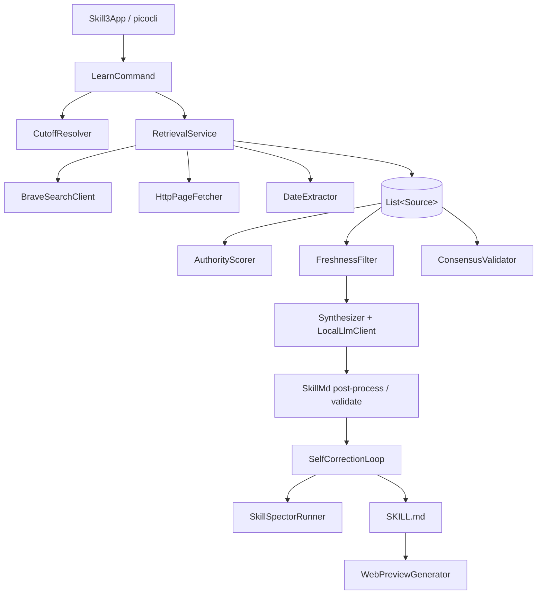

# Skill3 Architecture

This document describes how Skill3 is structured and how data flows through it.
For *what* it does, see [SPEC.md](SPEC.md); for the build order, see [PLAN.md](PLAN.md).

## Overview

Skill3 is a single-process Java CLI. A `learn` invocation runs a linear pipeline;
each stage enriches or filters a list of `Source` objects until a `SKILL.md` is
synthesized and vetted.

## Packages

| Package | Responsibility |
|---|---|
| `se.deversity.skill3` | `Skill3App` entry point. |
| `se.deversity.skill3.cli` | `SetupCommand`, `LearnCommand` (picocli). |
| `se.deversity.skill3.model` | `Source`, `ContextBundle`, `Cutoff` — plain data carriers. |
| `se.deversity.skill3.pipeline` | Discovery + evaluative ingestion: `RetrievalService`, `BraveSearchClient`, `HttpPageFetcher`, `DateExtractor`, `AuthorityScorer`, `FreshnessFilter`, `ConsensusValidator`, `CutoffResolver`. |
| `se.deversity.skill3.llm` | `LocalLlmClient` (OpenAI-compatible), `Synthesizer`, and SKILL.md guarantees (`NameSanitizer`, `SkillMdPostProcessor`). |
| `se.deversity.skill3.skillspector` | `SkillSpectorRunner` (ProcessBuilder), `SkillSpectorReport`, `SelfCorrectionLoop`. |
| `se.deversity.skill3.web` | `WebPreviewGenerator`. |

## Key design decisions

### Cutoff-anchored freshness (general, not per-topic)
There are **no hardcoded deprecation rules**. `CutoffResolver` maps a
`--target-model` to a knowledge-cutoff month (overridable with `--cutoff-time`).
`FreshnessFilter` scores each source `authority × recency`, where post-cutoff
publication earns the full recency weight. Sorting by the combined score realizes
the override rule from the spec: a post-cutoff authoritative source
(`1.0 × 1.0`) always outranks pre-cutoff content (`≤ 1.0 × 0.5`). `--strict-cutoff`
promotes the soft floor to a hard filter (pre-cutoff and undated sources dropped).

### Two distinct "models"
- **Target model** (`--target-model`) — only a cutoff lookup; never called.
- **Synthesis model** (`--llm-model` / `--llm-endpoint`) — the local LLM that
  writes the skill.

### Deterministic SKILL.md guarantees
The LLM drafts the skill; `SkillMdPostProcessor` + `NameSanitizer` **guarantee**
format compliance independent of the model: name charset (`[a-z0-9-]`, ≤64),
reserved-word stripping (`anthropic`/`claude`), and description limits (non-empty,
≤1024, no XML tags). A non-compliant draft is fixed or regenerated, never emitted.

### Hybrid vetting
`SelfCorrectionLoop` runs `SkillSpectorRunner`, applies deterministic
sanitization (strip detected secrets, drop flagged lines), then a local-LLM
revision pass, and rescans — up to 3 iterations. Residual findings are surfaced
as warnings rather than silently dropped.

### Testability via interfaces
Network and LLM access sit behind interfaces (`SearchClient`, `PageFetcher`,
`ChatModel`), so the pure logic (scoring, freshness, consensus, date extraction,
name sanitization, cutoff resolution) is unit-tested with mocks and HTML
fixtures — no live network or model required.

## Trust boundaries

- Scraped page text is treated as **untrusted data**: it is delimited in the
  synthesis prompt, the model is constrained to the supplied context, and the
  *output* is vetted by SkillSpector.
- External processes (`git`, the venv `skillspector`) are invoked via
  `ProcessBuilder` with explicit argument lists — never a shell string.
- The only network egress is discovery (Brave + scraping) and the local LLM
  endpoint (loopback by default).

## Failure handling

- Missing/unknown `--target-model` with no `--cutoff-time` → clear error.
- SkillSpector not installed → vetting skipped with a warning (skill still
  emitted).
- Undated sources → low recency weight; excluded entirely under `--strict-cutoff`.
- Unreachable LLM endpoint → `learn` fails loudly (synthesis is required).
